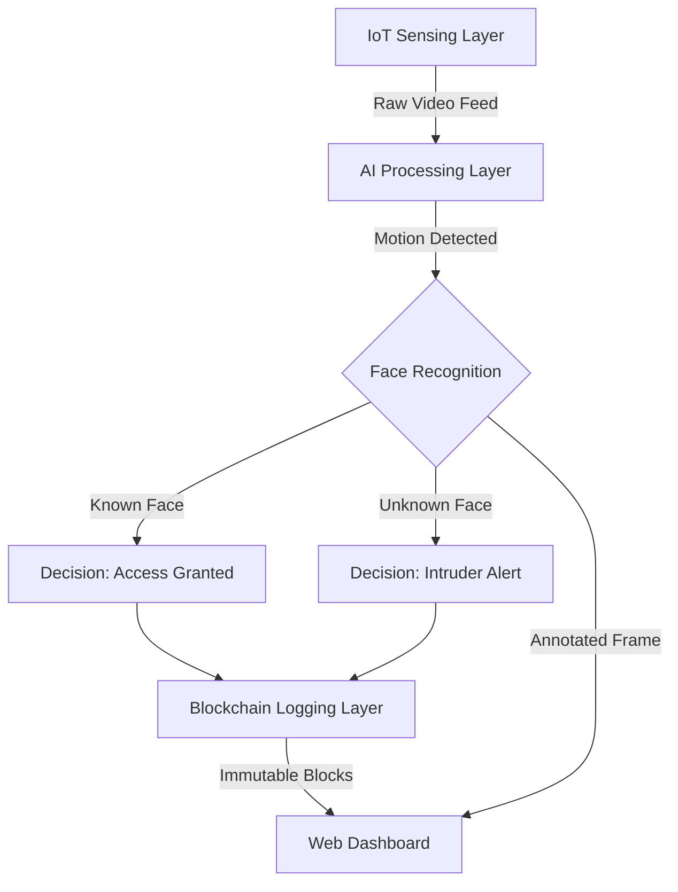

# System Architecture

## High-Level Design
The system follows a modular pipeline architecture where data flows from the sensing layer to the application layer, secured by the blockchain layer.

## Module Description

### 1. IoT Sensing Layer (The "Eyes")
- **Component**: Laptop Webcam + OpenCV.
- **Function**: Continuously monitors the environment. Uses frame differencing algorithms to detect motion. This simulates an "Always-on" IoT camera sensor.

### 2. AI Processing Layer (The "Brain")
- **Component**: Face Recognition Models (dlib/HOG).
- **Function**: Extracts 128-d facial embeddings from the detected face and compares them against a known database of authorized users.

### 3. Decision & Alert Layer (The "Logic")
- **Component**: Python Control Logic.
- **Function**: Based on the AI output, it determines the security state.
    - If Match: Log "Entry" event.
    - If No Match: Log "Intrusion" event + Trigger Alert.

### 4. Blockchain Layer (The "Vault")
- **Component**: Custom Python Blockchain Class.
- **Function**: Creates a new block for every event.
    - **Block Structure**: `[Index, Timestamp, Event_Type, Hash, Previous_Hash]`.
    - **Constraint**: Each block's hash depends on the previous block, making the chain immutable.

### 5. Application Layer (The "View")
- **Component**: Flask Web Server.
- **Function**: Fetches the latest chain data and renders it on a dashboard for the user to review.
